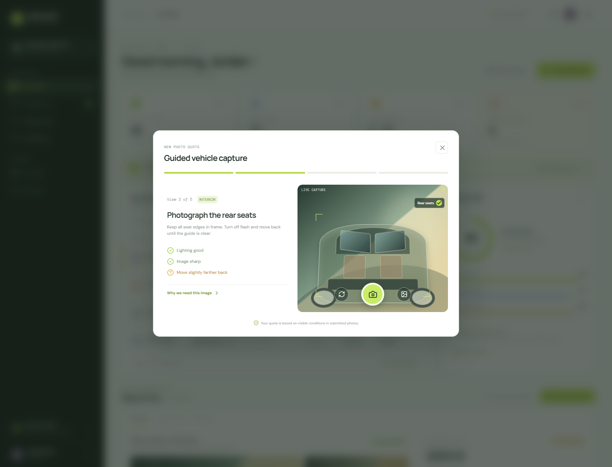
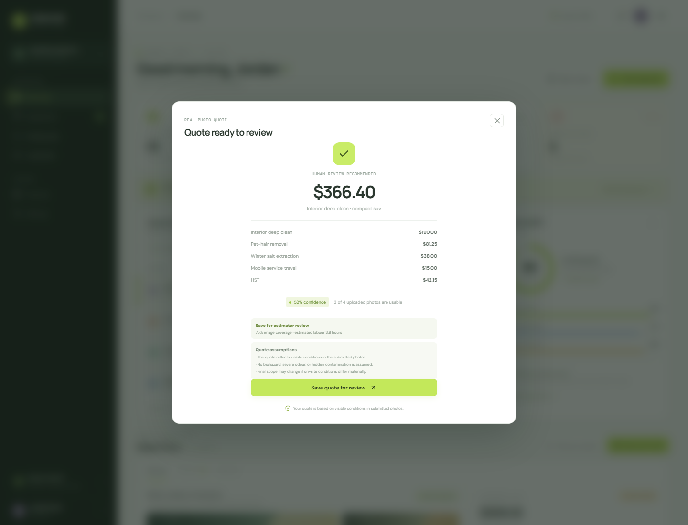

# Clearcoat Quote Studio


> A photo-to-quote workspace for auto detailing teams — built in one day for a Winnipeg detailing business to reduce manual quote follow-up.

[](https://github.com/Fink692/clearcoat-quote-studio/actions/workflows/ci.yml)
[](https://nextjs.org/)
[](https://www.typescriptlang.org/)
[](#project-status)

## Why it exists

Auto detailers lose time translating customer photos into a scope of work, pricing add-ons, and a message that customers can understand. Clearcoat turns that process into a structured inspection and quote workflow.

Customers upload vehicle photos. The system checks photo quality, records visible conditions, calculates a transparent CAD quote, and routes low-evidence inspections to human review instead of presenting uncertain work as guaranteed.

## Product tour

### Estimator workspace

The dashboard gives the estimator one place to review the inspection queue, confidence, evidence, quote status, and next action.


### Guided photo capture

The capture flow supports existing phone photos and gives the estimator a clear evidence path before pricing the job.


### Evidence review

Uploaded images are checked in the browser for resolution, exposure, and sharpness. Visible conditions are selected and priced as explicit line items.



### Customer-ready quote

The quote view makes the scope, taxes, travel, labour estimate, confidence, and assumptions visible before the quote is saved or sent.



## Core capabilities

### Quote workflow

- Upload JPEG, PNG, WebP, or HEIC vehicle photos
- Analyze image dimensions, exposure, and sharpness locally in the browser
- Capture vehicle class, service type, postal code, and mobile-service preference
- Record visible conditions such as pet hair, winter salt, stains, road film, brake dust, and water spots
- Generate CAD line items, HST, total, labour estimate, confidence, assumptions, and review actions
- Route incomplete evidence to “more photos” or “human review” states

### Estimator operations

- Searchable inspection queue
- Confidence and evidence coverage indicators
- Editable labour estimate with override notes
- Approval and customer-notification states
- Evidence and audit-oriented UI language

### Administration

- Versioned pricing-rule surface
- Customer records
- Dispatch calendar surface
- Photo retention and privacy controls
- Data-rights and model-improvement consent surfaces

## How the quote engine works

The UI and API share the same deterministic pricing function in [`lib/quote-engine.ts`](lib/quote-engine.ts).

```text
photos + vehicle/service inputs
              ↓
local quality checks + visible conditions
              ↓
base package + condition add-ons + mobile travel
              ↓
HST + labour estimate + confidence routing
              ↓
transparent quote or human-review recommendation
```

The engine supports interior deep clean, exterior decontamination, and combined detail packages across sedan, compact SUV, full-size SUV, and truck body types.

## Example output

For a heavily soiled full-size SUV interior with visible salt and severe stain/spill treatment, the current ruleset produced:

| Item | Amount |
| --- | ---: |
| Interior deep clean | C$225.00 |
| Winter salt extraction | C$47.50 |
| Stain and spill treatment | C$134.40 |
| Mobile service travel | C$15.00 |
| HST | C$54.85 |
| **Total** | **C$476.75** |

The inspection was intentionally held for more evidence because only two of three submitted photos were usable. That uncertainty is part of the product behavior.

## API

The quote API is provider-neutral and does not require Stripe or another payment provider.

### `GET /api/quotes`

Returns the seeded inspection quote used by the estimator workspace.

### `POST /api/quotes`

Generates a quote from the shared engine. Example request:

```json
{
  "service": "interior_deep_clean",
  "bodyType": "full_size_suv",
  "mobileService": true,
  "postalCode": "R3C 1A5",
  "imageCount": 4,
  "usableImageCount": 4,
  "qualityScore": 0.86,
  "conditions": [
    { "code": "winter_salt", "severity": 2, "coverage": "moderate" },
    { "code": "stain_spill", "severity": 3, "coverage": "small" }
  ]
}
```

### `GET/PATCH /api/quotes/:quoteId`

Provides the provider-neutral quote lifecycle surface used by the prototype.

## Local development

### Requirements

- Node.js 20+
- npm 10+

### Run the app

```bash
git clone https://github.com/Fink692/clearcoat-quote-studio.git
cd clearcoat-quote-studio
npm install
npm run dev
```

Open [http://localhost:3000](http://localhost:3000).

### Verify the build

```bash
npx tsc --noEmit
npm run build
```

## Deployment

This is a standard Next.js App Router project and can be deployed to Vercel from the repository or with the Vercel CLI:

```bash
npx vercel login
npx vercel --prod
```

No environment variables are required for the local quote workflow. Production storage, authentication, notifications, and server-side inference can be added behind the existing API boundary.

## Architecture

```text
Next.js App Router
├── app/page.tsx                 estimator + quote UI
├── app/api/quotes                quote API routes
├── lib/quote-engine.ts           shared deterministic pricing
├── app/globals.css               responsive product styling
├── docs/clearcoat                implementation notes
└── screenshots                   product documentation images
```

## Project status

This repository contains a working quote-only MVP. It is intentionally explicit about its current boundaries:

- The local image analysis checks quality; it is not trained computer vision and does not infer hidden damage.
- Conditions are selected or confirmed by the estimator/customer workflow.
- Heavy debris, contamination, odour, biohazard, and materially different on-site conditions require human review.
- There is no Stripe or payment processing integration.
- Storage, authentication, notifications, and persistent production data are future integration points.

## License

This is a private MVP repository made public for portfolio and collaboration purposes. Contact the repository owner before reusing the product, branding, or screenshots commercially.
